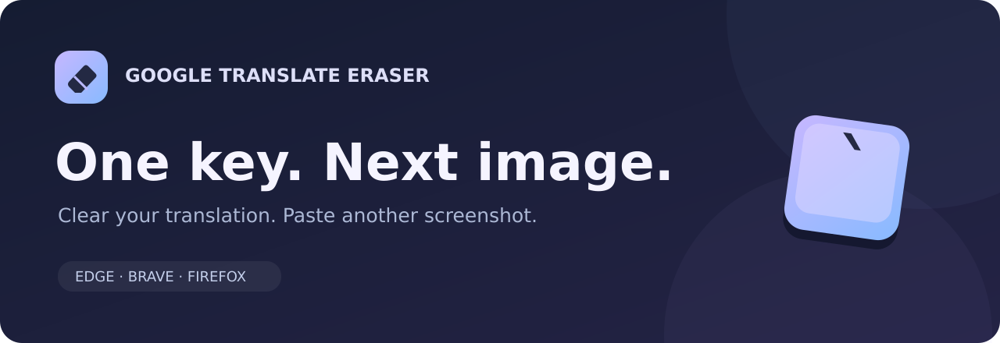
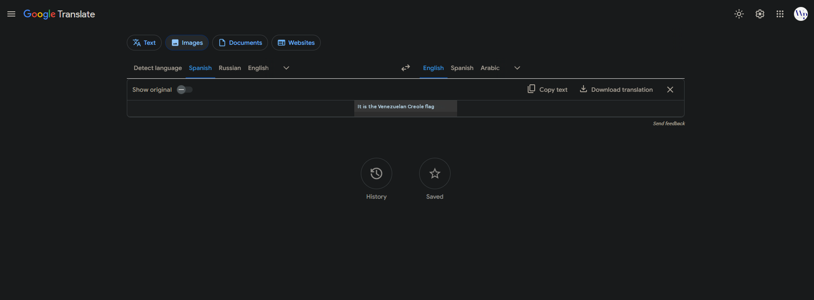
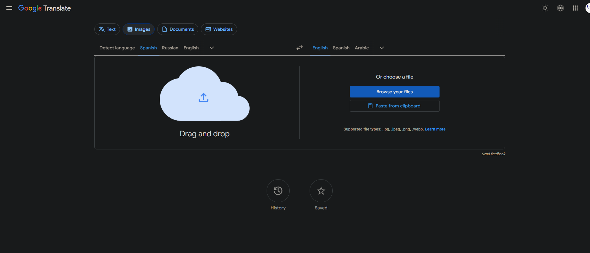

  

  Clear your current Google Translate image with <kbd>`</kbd> and paste the next screenshot.
    
  <a href="https://github.com/tobiko-dev/google-translate-eraser/raw/refs/heads/main/downloads/google-translate-image-clear-v1.1.1-flat.zip"><strong>Download extension ↓</strong></a>
  &nbsp; · &nbsp;
  <a href="https://translate.google.com/?op=images">Open Google Translate Images ↗</a>
    
  Edge · Brave · Firefox (temporary installation)

## Paste. Translate. Clear. Repeat.

Read your translation, press <kbd>`</kbd>, and you're ready for another image. The current image is fully cleared. Click outside text fields before using the shortcut.

**Your image, translated**

**Press <kbd>`</kbd> → ready for the next screenshot**

## Install in Edge or Brave

1. **[Download the ZIP](https://github.com/tobiko-dev/google-translate-eraser/raw/refs/heads/main/downloads/google-translate-image-clear-v1.1.1-flat.zip)** and extract it.
2. Open `edge://extensions` or `brave://extensions` and turn on **Developer mode**.
3. Click **Load unpacked**, select the extracted folder containing `manifest.json`, then refresh Google Translate.

<strong>Using Firefox?</strong>

1. Download and extract the same ZIP.
2. Open `about:debugging#/runtime/this-firefox` and click **Load Temporary Add-on…**.
3. Select `manifest.json`, then refresh Google Translate.

Firefox removes temporary add-ons when it restarts. For an installation that stays, use the **[permanent Firefox setup](FIREFOX_SETUP.md)**. The ZIP above is for temporary installation.

 

No account or setup inside the extension. Your normal typing stays available in text fields.

[Technical details & troubleshooting](TECHNICAL_DETAILS.md)

Independent project by tobiko-dev. Not affiliated with Google.
